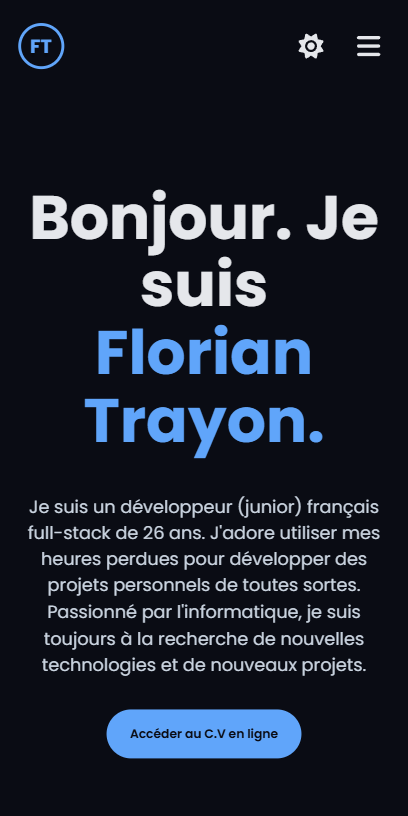
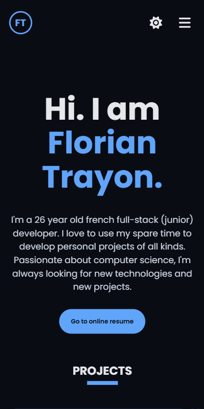

# 📚 Portfolio

## In French

> [!IMPORTANT]
> Depuis mars 2026, le code du projet est désormais hébergé sur mon instance GitLab personnalisée, accessible à [cette adresse](https://git.florian-dev.fr/floriantrayon/Portfolio). Le dépôt GitHub est un miroir du dépôt GitLab, **mis à jour automatiquement**.
>
> **Les contributions publiques restent sur GitHub et sont les bienvenues** ; les pull requests validées y seront ensuite transférées manuellement sur GitLab pour être intégrées. 🙂

Ceci est mon portfolio tout simplement ! Au départ, il s'agissait de mon tout premier site Internet réalisé durant mes études et utilisant HTML, CSS, JavaScript ainsi que PHP sans aucun framework particulier. Plusieurs mois ont défilé et j'ai décidé de le refaire complètement en adoptant un nouveau design inspiré de [ce portfolio](https://github.com/rajshekhar26/cleanfolio) avec Next.js ainsi que des technologies beaucoup plus modernes.

Les anciennes versions de mon portfolio sont également disponibles sur les autres branches GitHub : `no-next-js` (dernière version utilisant PHP), `no-gmail` (version PHP ayant encore un formulaire de contact sans GMail), `no-sass` (version PHP sans l'utilisation du préprocesseur SASS) et `no-php` (version utilisant seulement HTML, CSS et JavaScript).

> [!TIP]
> Voir le fichier [SETUP.md](SETUP.md) pour consulter les instructions d'installation.

## In English

> [!IMPORTANT]
> Since March 2026, the project's code has been hosted on my custom GitLab instance, accessible at [this address](https://git.florian-dev.fr/floriantrayon/Portfolio). The GitHub repository is a mirror of the GitLab repository, **automatically kept up to date**.
>
> **Public contributions remain on GitHub and are welcome**; validated pull requests will then be manually transferred to GitLab to be integrated. 🙂

This is my portfolio! At the beginning, it was my very first website made during my studies and using HTML, CSS, JavaScript and PHP without any framework. Several months later, I decided to redo it completely by adopting a new design inspired by [this portfolio](https://github.com/rajshekhar26/cleanfolio) with Next.js and much more modern technologies.

Older versions of my portfolio are also available on the other GitHub branches: `no-next-js` (latest version using PHP), `no-gmail` (PHP version still having a contact form without GMail), `no-sass` (PHP version without using the SASS preprocessor) and `no-php` (version using only HTML, CSS and JavaScript).

> [!TIP]
> See the [SETUP.md](SETUP.md) file for setup instructions.

